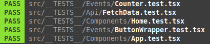

<div align='center'>



</div>

### About

> ⚠️ This repo is under construction! ⚠️

This repo tackles and dives deep into [`unit testing`](https://www.techtarget.com/searchsoftwarequality/definition/unit-testing#:~:text=Unit%20testing%20is%20a%20software,developers%20and%20sometimes%20QA%20staff).
This is a way to evaluate and assess a specific segment of the system.

### For a better start

```
$ git clone ...
$ cd into the repo
$ git checkout dev
$ git checkout -b your-branch
$ npm i
$ npm

```

Launches the test runner in the interactive watch mode.\
See the section about [running tests](https://facebook.github.io/create-react-app/docs/running-tests) for more information.

### Table of Contents

1. Beginner
   > This is for entry basic introduction of testing this includes:

```
- Api
- Components
- Functions
- Layouts
- Hooks
```

2. Intermediate

   > ⚠️ Wait a minute whehe! ⚠️

3. Advance

   > ⚠️ Waiting a minute wheeh! ⚠️

4. Bells and Whistles

### Youtube Reference

- TypeScript/React Testing: Components, Hooks, Custom Hooks, Redux and Zustand
  [Jack Harrington](https://www.youtube.com/watch?v=bvdHVxqjv80&t=708s).

### Technologies Used

- For API Mock Server [MSW]](https://mswjs.io/docs/getting-started/install)
- React Testing library [built-in](https://facebook.github.io/create-react-app/docs/running-tests)
- [Typescript](https://www.typescriptlang.org/docs/handbook/react.html)
- [JEST](https://jestjs.io/docs/getting-started)

<!-- ### What have been tested:

- Api
- Components
- Functions
- Layouts
- Hooks -->
